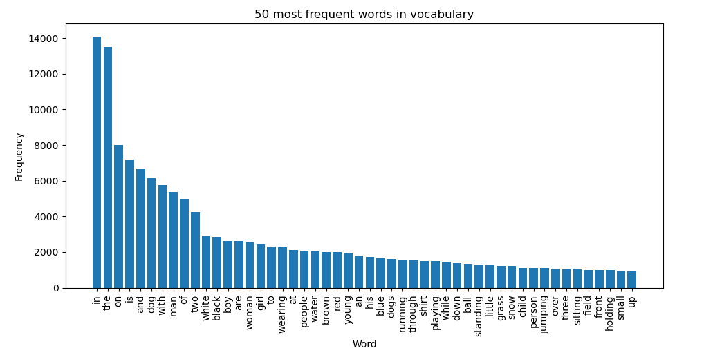

# Image Caption Generator (baseline model)

*Windows users - use cmd instead of bash. Windows virtual machine does not support GPU training on tensorflow*  

<!-- Model is based on [How to Develop a Deep Learning Photo Caption Generator from Scratch](https://machinelearningmastery.com/develop-a-deep-learning-caption-generation-model-in-python/). -->

## Updates
- **18/03/2021**
    - Added option to use pre-trained models EfficientNetB7 and InceptionV3 for feature extraction.
    - Added option to use injection model architecture instead of merge model architecture.
    - Performance of new model variations are to be added after training is completed. 
- **23/03/2021**
    - Added performances of model variations.
- **24/03/2021**
    - Added Glove embedding layer
    - Added beam search to the model extensions
    - Added model abbreviation table 
- **28/03/2021**
    - Added reduced vocabulary functionality (along with data exploration for the training set vocabulary)
    - Added appendix with model architecture descriptions
- **29/03/2021**
    - Added EfficientNetB7 for feature extraction
    - Added progressive loading functionality  
- **30/03/2021**
    - Added Preprocessing section in readme 
     - Added beam search and greedy search explanations under the Model Evaluation section    
- **31/03/2021**
    - Added performances of model variations
    - Added beam search functionality to eval.py and new_example_pred.py
    - Added model variation accuracies
    - Added quantitative results
- **5/04/2021** 
    - Added object orientated structure for ease of use and to remove redundant functions    

## Run instructions
#### 1 - Folder setup
Download dataset files and place within github repo. Your folder structure should look as follows:
```
|-- /data
    -- Flickr8k_Dataset
    -- Flickr8k_text
|-- /trained_models
|-- .gitignore
|-- train.py
|-- eval.py
|-- prepare_data.py
|-- new_example_pred.py
|-- README.md
```
Trained models will be saved in the *trained_models* folder. 
#### 2 - Set up conda environment
```
conda create --name env
conda activate env
```
For python 3.7:
```
conda install tensorflow-gpu=2.3 tensorflow=2.3=mkl_py37h936c3e2_0 pydot keras Pillow nltk
```
For python 3.8:
```
conda install tensorflow-gpu=2.3 tensorflow=2.3=mkl_py38h1fcfbd6_0 pydot keras Pillow nltk
```
#### 3 - Prepare data
```
python prepare_data.py
```
- Clean image captions (saved as descriptions.txt)
- Extract image features using VGG-16 (saved as features.pkl). The image features are a 1-dimensional 4,096 element vector.
#### 4 - Train model
```
python train.py
```
- Model is fitted and evaluated on holdout development dataset. When the skill of the model on the development dataset improves at the end of an epoch, we will save the whole model to file (.h5 file).
- At the end of the run, we can then use the saved model with the best skill on the training dataset as our final model.

#### 5 - Evaluate model
```
python eval.py
```
- Trained model is used to generate descriptions for the holdout test set
- The actual and predicted descriptions are collected and evaluated collectively using the corpus BLEU score that summarizes how close the generated text is to the expected text.

#### 6 - Generate caption for new input image
```
new_example_pred.py <image path> <feature model> <reduced vocab (bolean)> 
```
**Command line arguments:**

*image path*: path to image (.jpg, .jpeg or .png file extension)
*feature model*: pre-trained model for feature extraction (vgg, inception or efficientnet)
*reduced vocab*: Toggle reduced vocabulary (True, False)

Outputs figure saved with filename <image_name>_captions.png. Figure will include image along with captions generated by greedy search and beam searches with k-values 3, 5 and 10.

## Dataset
##### Flickr8K dataset
- Flickr8k_Dataset.zip  ([Download here](https://github.com/jbrownlee/Datasets/releases/download/Flickr8k/Flickr8k_Dataset.zip)) (1 Gigabyte)
    - Contains 8092 JPEG images
    

- Flickr8k_text.zip ([Download here](https://github.com/jbrownlee/Datasets/releases/download/Flickr8k/Flickr8k_text.zip)) (2.2 Megabytes)
    - Flickr8k.token.txt: the raw captions of the Flickr8k Dataset . The first column is the ID of the caption which is “image address # caption number”
    - Flickr_8k.trainImages.txt: The training images used in our experiments
    - Flickr_8k.devImages.txt: The development/validation images used in our experiments
    - Flickr_8k.testImages.txt: The test images used in our experiments


The dataset has a pre-defined training dataset (6,000 images), development dataset (1,000 images), and test dataset (1,000 images).

##### Example of dataset entry
Image with the description pairs

<p align="center">

</p>

## Preprocessing:

### Vocabulary
Before tokenizing the image captions/descriptions, we have to clean up the captions. The following cleaning was done on the image captions:
 - Convert all words to lowercase.
 - Remove all punctuation
 - Remove all words that are one character or less in length (e.g. 'a')
 - Remove all words with numbers in them

There are words that are seldomly used or misspelled words within the vocabulary of the dataset. The LSTM model produces a probability distribution over each word in the vocabulary. If we reduce the vocabulary to words occurring above a certain threshold, we reduce the number of possible words the LSTM model has to predict and subsequently narrowing the class distribution over the words.  The drawback of limiting the vocabulary is that the model will be less expressive when generating captions. 

Number of unique words: 8828

Statistical summary of the vocabulary word frequencies:  

*Standard deviation*: 639.93  
*Mean word frequency*: 44.01  
*Min word frequency*: 1  
*Max word frequency*: 14094  

The below bar plot gives the top 50 most frequent words and their frequencies within the training descriptions.
<p align="center">

</p>

We notice a heavily skewed distribution of the word frequencies, with the most frequent word being "in" (occurring 14094 times). We also notice that there are 7166 words occurring less than 10 times. 

We limit the vocabulary to words only occurring more than 10 times. By doing this, we reduce the vocabulary size to 1662. 

**Caption Length**

Statistical summary of the caption lengths of the training set:

*Standard deviation*:  3.45  
*Mean caption length*:  10.77  
*Min caption length*:  1   
*Max caption length*:  34  

Below is a bar plot of the caption lengths.

<p align="center">

</p>

We notice that the longest caption is of 34 words. The LSTM could then expect an padded input sequence with a pre-defined length of 34. 

## Glove Embeddings
Word vectors map words to a vector space, where similar words are clustered together and different words are separated. We will be using Glove over Word2Vec, since GloVe does not just rely on the local context of words but it incorporates global word co-occurrence to obtain word vectors.

The basic premise behind Glove is that we can derive semantic relationships between words from the co-occurrence matrix. For our model, the longest possible description length is 34 words. Therefore, we will map all the words in our 34-word long caption to a 200-dimension vector using Glove.

This mapping will be done in a separate layer after the input layer called the embedding layer.

The embedding layer is where the partial caption of max length 34, is fed into, and the words are mapped to a 200-dimension Glove embedding. Before training we freeze the embedding layer since we do not want to retrain the weights in our embedding layer.

Download the pre-trained word vector used in this project from [here](https://nlp.stanford.edu/projects/glove/).

## Model architecture discussion

The model is based on the "merge-model" described in [Marc Tanti, et al.](https://arxiv.org/abs/1703.09137), which is a encoder-decoder recurrent neural network architecture. A merge model combines both the encoded form of the image input with the encoded form of the text description generated at the current stage. The combination of these two encoded inputs is then used by a very simple decoder model to generate the next word in the sequence.

In the case of ‘merge’ architectures, the image is left out of the RNN subnetwork, such that the RNN handles only the caption prefix, that is, handles only purely linguistic information. After the prefix has been vectorised, the image vector is then merged with the prefix vector in a separate ‘multimodal layer’ which comes after the RNN subnetwork
<p align="center">

</p>

Apposed to the merge model, the inject model combines the encoded form of the image with each word from the text description generated so-far. The approach uses the recurrent neural network as a text generation model that uses a sequence of both image and word information as input in order to generate the next word in the sequence.

In these ‘inject’ architectures, the image vector (usually derived from the activation values of a hidden layer in a convolutional neural network) is injected into the RNN, for example by treating the image vector on a par with a ‘word’ and including it as part of the caption prefix.

<p align="center">

</p>

### Describing our model (Merge model)

#### - Photo Feature Extractor
This is a 16-layer VGG model pre-trained on the ImageNet dataset. We have pre-processed the photos with the VGG model (without the output layer) and will use the extracted features predicted by this model as input.

The Photo Feature Extractor model expects input photo features to be a vector of 4,096 elements. These are processed by a Dense layer to produce a 256 element representation of the photo.

#### - Sequence Processor
This is a word embedding layer for handling the text input, followed by a Long Short-Term Memory (LSTM) recurrent neural network layer.

The Sequence Processor model expects input sequences with a pre-defined length (34 words) which are fed into an Embedding layer that uses a mask to ignore padded values. This is followed by an LSTM layer with 256 memory units.

Both the input models produce a 256 element vector. Further, both input models use regularization in the form of 50% dropout. This is to reduce overfitting the training dataset, as this model configuration learns very fast.

#### - Decoder
Both the feature extractor and sequence processor output a fixed-length vector. These are merged together and processed by a Dense layer to make a final prediction.

The Decoder model merges the vectors from both input models using an addition operation. This is then fed to a Dense 256 neuron layer and then to a final output Dense layer that makes a softmax prediction over the entire output vocabulary for the next word in the sequence.

### Model Visualized
*The most basic merge model without Glove*
<p align="center">

</p>

### Model Evaluation

Model is evaluated on the holdout test set. Predicted captions are evaluated using a standard cost function.

First, captions for each test set photo is generated by using the trained model. A start description token *'startseq'* is passed and one word is generated, followed by calling the model recursively with the previously generated words as inputs, until the end of the sequence token *'endseq*' or the maximum description length is reached.  

#### Evaluation metric
The actual and predicted descriptions are collected and evaluated collectively using the corpus BLEU score that summarizes how close the generated text is to the expected text.  BLEU scores are used in text translation for evaluating translated text against one or more reference translations.

The Bilingual Evaluation Understudy Score, or BLEU for short, is a metric for evaluating a generated sentence to a reference sentence. A perfect match results in a score of 1.0, whereas a perfect mismatch results in a score of 0.0. The approach works by counting matching n-grams in the candidate translation to n-grams in the reference text, where 1-gram or unigram would be each token and a bigram comparison would be each word pair. The comparison is made regardless of word order.

" *A perfect score is not possible in practice as a translation would have to match the reference exactly. This is not even possible by human translators. The number and quality of the references used to calculate the BLEU score means that comparing scores across datasets can be troublesome.* "

Cumulative scores refer to the calculation of individual n-gram scores at all orders from 1 to n and weighting them by calculating the weighted geometric mean. For instance, BLEU-4 calculates the cumulative 4-gram BLEU score. The weights for the BLEU-4 are 1/4 (25%) or 0.25 for each of the 1-gram, 2-gram, 3-gram and 4-gram scores.

For this experiment we make use of BLEU-1, BLEU-2, BLEU-3 and BLEU-4.

#### Greedy search

A simple approximation is to use a greedy search that selects the most likely word at each step in the output sequence of the LSTM. This approach has the benefit that it is very fast, but the quality of the final output sequences may be far from optimal.

The argmax() mathematical function can be used to select the index of an array that has the largest value. We can use this function to select the word index that is most likely at each step in the sequence. 

#### Beam search 
Beam search is an expansion of greedy search and returns a list of most likely output sequences. Instead of greedily choosing the most likely next step as the sequence is constructed, the beam search expands all possible next steps and keeps the *k* most likely, where *k* is a user-specified parameter and controls the number of beams or parallel searches through the sequence of probabilities.

"*The local beam search algorithm keeps track of *k* states rather than just one. It begins with *k* randomly generated states. At each step, all the successors of all *k* states are generated. If any one is a goal, the algorithm halts. Otherwise, it selects the *k* best successors from the complete list and repeats.*"

We start with the *k* most likely words as the first step in the sequence. Common beam width values are 1 for a greedy search and values of 5 or 10 for common benchmark problems in machine translation. Larger beam widths result in better performance of a model as the multiple candidate sequences increase the likelihood of better matching a target sequence. This increased performance results in a decrease in decoding speed.

The search process can halt for each candidate separately either by reaching a maximum length, by reaching an end-of-sequence token, or by reaching a threshold likelihood.

### Model performance and comparison

| Abbreviation | Description |
| ------       | ---------   |
| Merge        | Merge architecture: A merge model combines both the encoded form of the image input with the encoded form of the text description generated at the current stage. |
| Injection | Injection architecture: the inject model combines the encoded form of the image with each word from the text description generated so-far. |
| VGG/Inception/EfficientNet | The pre-trained neural network used for feature extraction. |
| RV | Reduced vocabulary. The absence of this abbreviation indicates the normal vocabulary was used.  |
| BS*k* | Beam Search with *k* indicating the number of beams. The absence of this abbreviation indicates that greedy search was used | 
| Glove | Indicates that the pre-trained embedding layer was used. |

Below are the BLEU-1,2,3,4 Metrics compared to other methods achieved on the Flickr8k test set.

| Model                                                         | BLEU-1 | BLEU-2 | BLEU-3 | BLEU-4 |
|---------------------------------------------------------------|--------|--------|--------|--------|
| [Xu et al., (2016)](https://arxiv.org/pdf/1502.03044.pdf)     |   67   |  45.7  |  31.4  |  21.3  |
| [Vinyals et al., (2014)](https://arxiv.org/pdf/1411.4555.pdf) |   63   |   41   |   27   |    -   |
| [Kiros et al., (2014)](https://arxiv.org/pdf/1411.4555.pdf)   |  65.6  |  42.4  |  27.7  |  17.7  |
| [Tanti et al., (2017)](https://arxiv.org/pdf/1708.02043.pdf)  | 60.1   | 41.1   | 27.4   | 17.9   |
| Merge-VGG                                                     | 57.78  | 34.32  | <ins>25.37</ins>  | 3.69   |
| Merge-Inception                                               | 56.50  | 27.97  | 18.25  | 7.93   | 
| Merge-EfficientNetB7                                          | 58.28  | 34.80  | 24.96  | 12.68  |
| Injection-VGG                                                 | 29.13  | 11.17  | 7.33   | 0.5    | 
| Merge-EfficientNetB7-Glove                                    | 57.59  | 35.07  | 22.35  | 13.63  |
| Merge-EfficientNetB7-RV                                       | 58.37  | 36.27  | 23.25  | 14.25   |
| Merge-EfficientNetB7-Glove-RV                                 | 60.38  | 36.96  | 23.27  | 14.17   |
| Merge-VGG-Glove-RV                                            | 46.60 | 22.36  | 12.34  | 6.63   |
| Merge-EfficientNetB7-Glove-RV-BS3                             | <ins>60.69</ins> | <ins>37.74</ins>  | 25.15  | <ins>16.43</ins>  |
Merge-EfficientNetB7-Glove-RV-BS5                             | 58.35 | 36.71  | 24.34  | 15.85 |
Merge-EfficientNetB7-Glove-RV-BS10                             | 55.73 | 34.57  | 22.99  | 15.00  |

### Qualitative evaluation

The following are captions generated by the Merge-EfficientNetB7-Glove-RV model on images from the testing set. 

<p align="center">

</p>

<p align="center">

</p>
<p align="center">

</p>


### Model Extensions
- [ ] ***Tune model***  
Tune hyper parameters for problem (learning rate, optimizer, batch size, number of layers, number of units, dropout rate, batch normalisation etc.)

- [x] ***Object oriented programming***  
Re-write code in a proper object oriented way to reduce function redundancy in files. This also makes the code easier to tweak/understand.  

- [x] ***Alternate Pre-trained Image models for Feature Vector***  
Instead of using VGG-16, consider a larger model that offers better performance on the ImageNet dataset, such as Inception or EfficientNet-B7

- [x] ***Pre-trained Word Vectors***  
The model learned the word vectors as part of fitting the model. Better performance may be achieved by using word vectors either pre-trained on the training dataset or trained on a much larger corpus of text, such as news articles or Wikipedia. GLove or WordNet would be appropriate candidates. 

- [x] ***Smaller Vocabulary***  
A larger vocabulary of nearly eight thousand words was used in the development of the model. Many of the words supported may be misspellings or only used once in the entire dataset. Refine the vocabulary and reduce the size, perhaps by half.

- [x] ***Beam Search***  
Previously, greedy search is used, where the the word with the highest probability is selected at each step in the output sequence. While this approach is often effective, it is obviously non-optimal. Instead of greedily choosing the most likely next step as the sequence is constructed, beam search expands all possible next steps and keeps the k most likely, where k is a user-specified parameter and controls the number of beams or parallel searches through the sequence of probabilities.

- [ ] ***Attention Mechanism***  
Attention-based mechanisms are becoming increasingly popular in deep learning because they can dynamically focus on the various parts of the input image while the output sequences are being produced. Using the whole representation of the image h to condition the generation of each word cannot efficiently produce different words for different parts of the image. This is exactly where an Attention mechanism is helpful.

- [ ] ***Bigger datasets***  
Make use of the larger datasets Flickr30k (30,000 images), MSCOCO (220,000 images), or Stock3M  (3 Million images). A bigger dataset would capture more examples of object interactions and hopefully be able to generalize better to unseen examples. Bigger datasets require more computing resources and training times. 


## A more complex model 
This model is based on [Vinyals et al.](https://arxiv.org/abs/1411.4555)'s implementation, with a few differences:
- For the pre-trained CNN, we used the EfficientNetB7 instead of Inception v1.
- For the RNN, we used a multi-layered LSTM instead of a single layer.
<!-- include this at a later stage -->
<!-- - Different hyperparameters that were achieved through parameter search

| Hyperparameter      | Value | 
|---------------------|-------|
| Learning rate          | 0.00051    |
| Batch size          | 32    |
| Epochs          | 33    |
| Dropout rate          | 0.22    |
| Embedding size          | 300    |
| LSTM output size          | 300    |
| LSTM layers          | 3    | -->

### Problem statement
*Given an image, find the most probable sequence of words (sentence) describing the image.* 

We solve this by maximizing the probability of the correct description given the image. In the training phase we want to find the best model's parameters \theta


# APPENDIX
## Model architecture terminologies

#### Dropout layer

For smaller datasets (like the one we are dealing with), larger neural networks are prone to overfitting the training data. This is due to the model learning the statistical noise in the training data, which can lead to poor performance on the testing set. 

One approach to reduce the overfitting is to fit various different neural networks on the same dataset and average the predictions. This is known as an ensemble of neural networks. This is computationally infeasible since multiple models have to be trained and maintained the dataset. 

A single model that can be used to simulate having a larger number of different network architectures by randomly dropping out nodes during training. This is known as dropout and offers a computationally inexpensive regularization method that reduces overfitting and improves generalization error. 

During training, some number of layer outputs are randomly ignored or *dropped-out*. This simulates the layer (which dropout is applied) to act like a layer with a different number of nodes and connectivity to the prior layer. As a result, each update to a layer is performed with a different view of the configured layer. 

" *By dropping a unit out, we mean temporarily removing it from the network, along with all its incoming and outgoing connections* "

Dropout simulates a sparse activation from a given layer, which interestingly, in turn, encourages the network to actually learn a sparse representation as a side-effect. As such, it may be used as an alternative to activity regularization for encouraging sparse representations in auto-encoder models.

Because the outputs of a layer under dropout are randomly subsampled, it has the effect of reducing the capacity or thinning the network during training. As such, a wider network, e.g. more nodes, may be required when using dropout.

#### Batch Normalization

Training deep neural networks with several layers, as they can be sensitive to the initial random weights and configuration of the learning algorithm. 

One possible reason for this difficulty is the distribution of the inputs to layers deep in the network may change after each mini-batch when the weights are updated. This can cause the learning algorithm to forever chase a moving target. This change in the distribution of inputs to layers in the network is referred to the technical name “*internal covariate shift*”.

Batch normalization is a technique for training very deep neural networks that standardizes the inputs to a layer for each mini-batch. This has the effect of stabilizing the learning process and dramatically reducing the number of training epochs required to train deep networks.

One aspect of this challenge is that the model is updated layer-by-layer backward from the output to the input using an estimate of error that assumes the weights in the layers prior to the current layer are fixed. Because all layers are changed during an update, the update procedure is forever chasing a moving target.

"*Batch normalization provides an elegant way of reparametrizing almost any deep network. The reparametrization significantly reduces the problem of coordinating updates across many layers.*"

It does this scaling the output of the layer, specifically by standardizing the activations of each input variable per mini-batch, such as the activations of a node from the previous layer. Recall that standardization refers to rescaling data to have a mean of zero and a standard deviation of one, e.g. a standard Gaussian. This is also known as "*whitening*". 

<!-- #### Repeat Vector


#### Time Distributed -->